# XDMA Driver Calling Sequences

This document describes the calling sequences for various operations in the XDMA Windows driver using Mermaid sequence diagrams.

## Driver Initialization Sequence

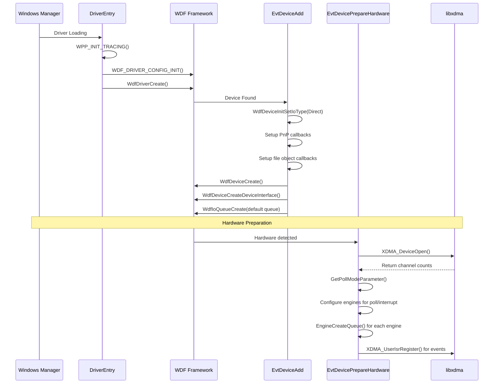

## File Creation Sequence

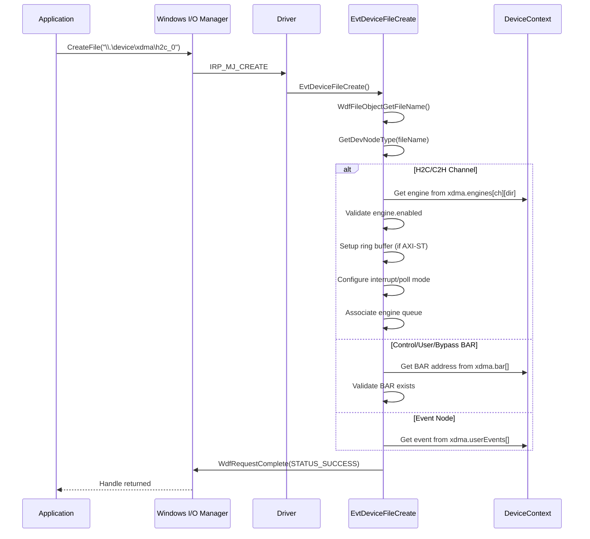

## DMA Write (H2C) Operation Sequence

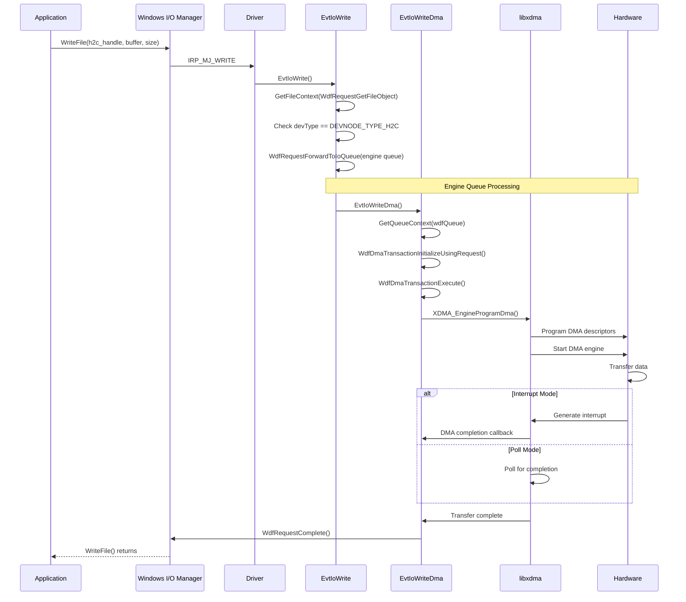

## DMA Read (C2H) Operation Sequence

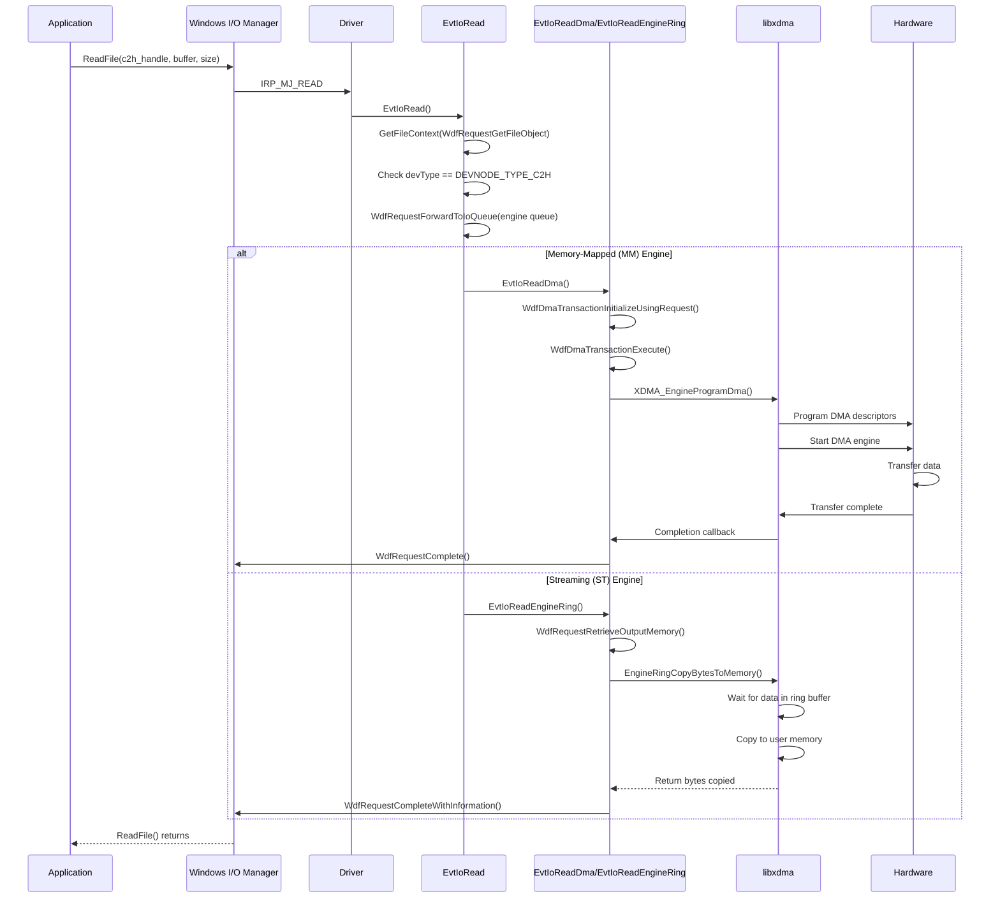

## BAR Access (Control/User) Sequence

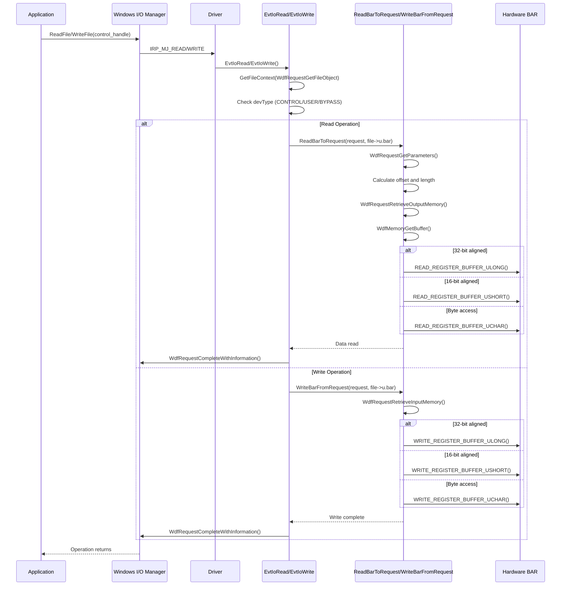

## IOCTL Operations Sequence

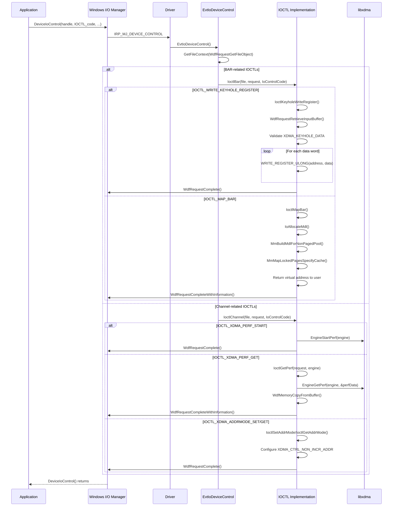

## User Event Handling Sequence

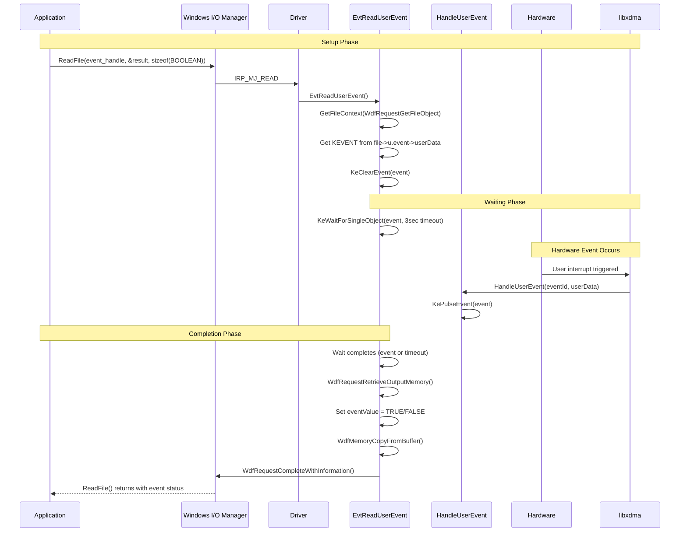

## Driver Unload Sequence

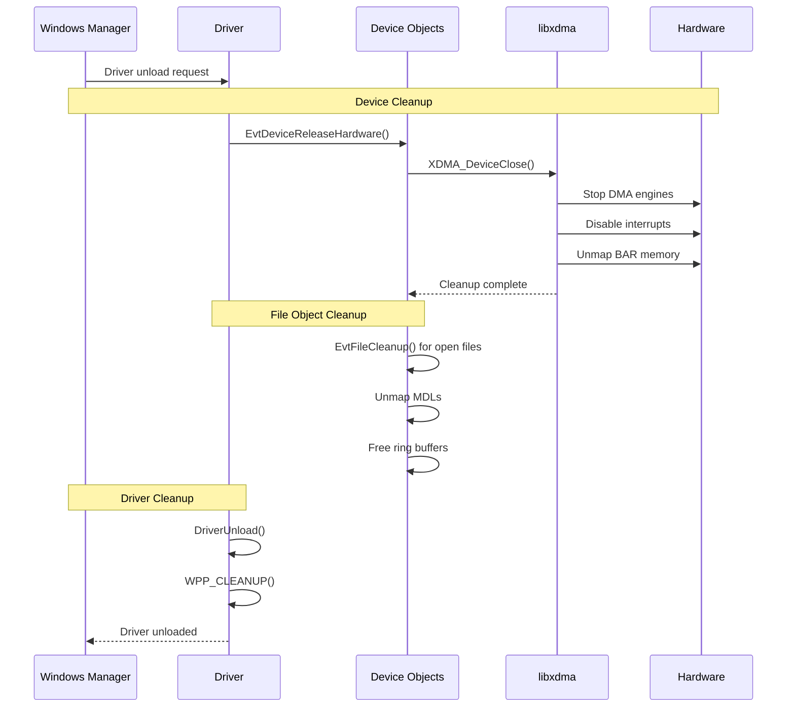

## Error Handling Sequences

### DMA Transfer Error Handling

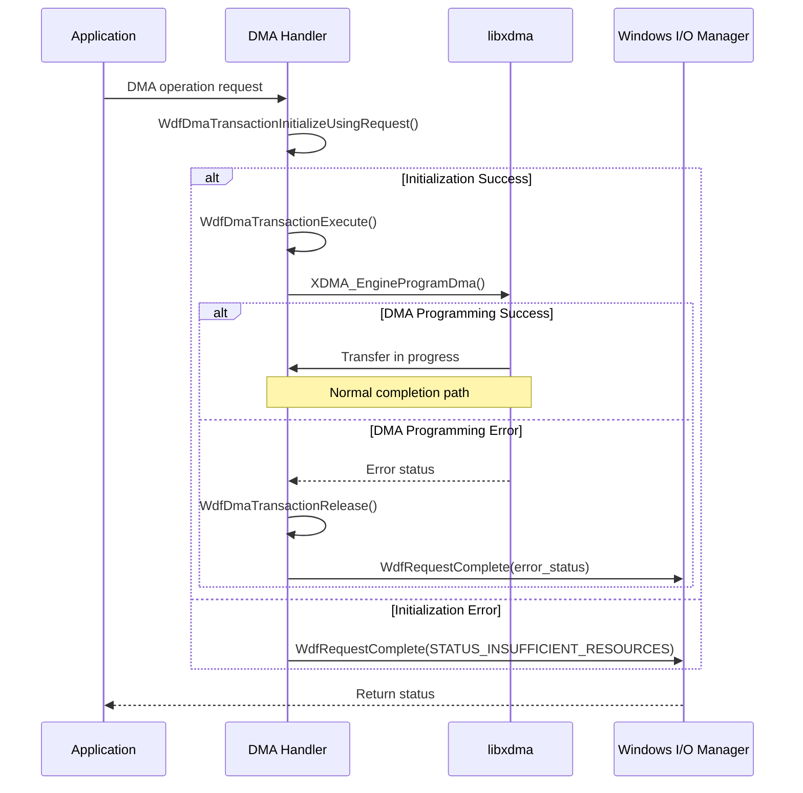

### File Creation Error Handling

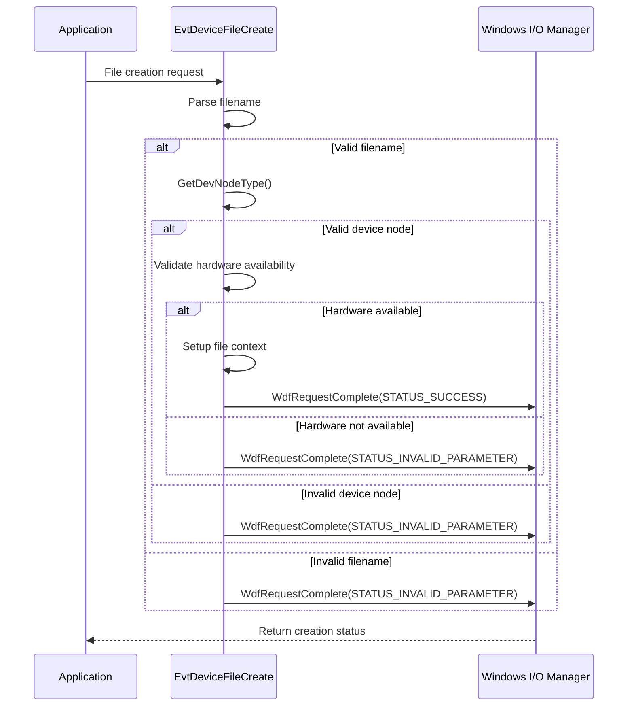

## Performance Optimization Sequences

### Interrupt vs Polling Mode

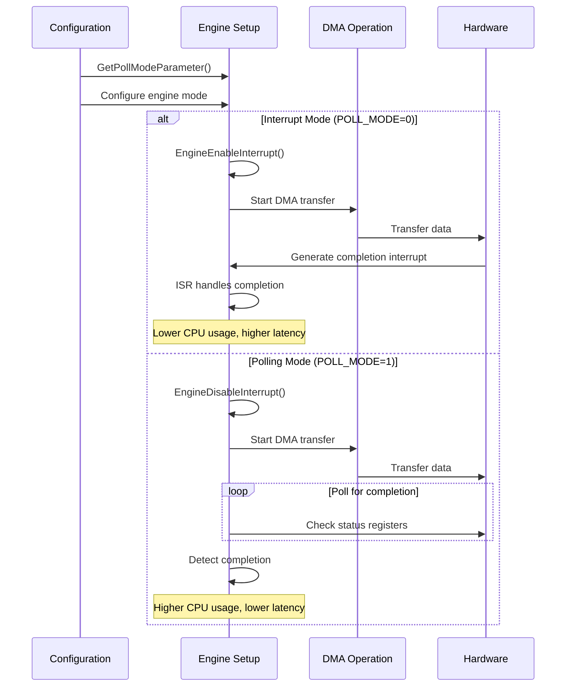

This sequence documentation provides a comprehensive view of how the XDMA driver operates, showing the interaction between user applications, Windows I/O Manager, the driver components, and the underlying hardware through libxdma.